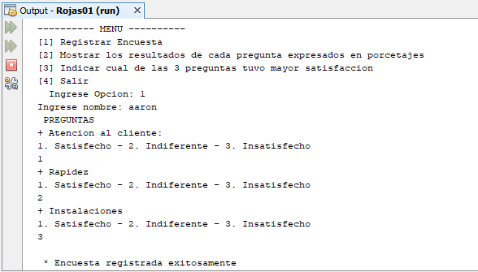

# Encuesta básica
Sistema de encuesta básica donde registras las respuestas de una encuesta, muestras los resultados de cada pregunta expresado en porcentaje y muestra cual de las preguntas tuvo mayor satisfacción, **15/11/19**.

<strong>Imagen:</strong> Menú principal - Registrar encuesta.

